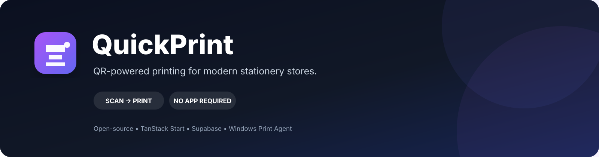
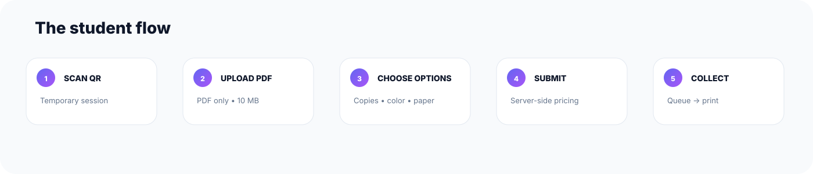
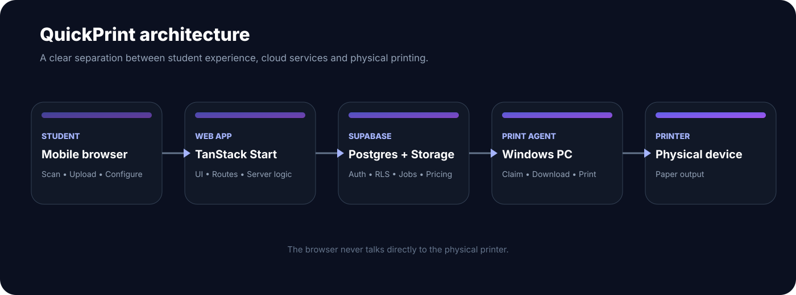

# QuickPrint

  

  <strong>Print from anywhere. Submit only when you're there.</strong> 
  QR-powered printing for stationery stores, colleges, libraries, and print centers.

  
  
  
  

  <a href="#why-quickprint">Why QuickPrint</a> ·
  <a href="#how-it-works">How it works</a> ·
  <a href="#architecture">Architecture</a> ·
  <a href="#getting-started">Get started</a> ·
  <a href="#print-agent">Print Agent</a> ·
  <a href="#security">Security</a>

---

## ✨ What is QuickPrint?

**QuickPrint is a QR-based printing platform that connects a student's phone to a physical printer without requiring a student app or browser-to-printer hacks.**

A stationery shop displays a temporary QR code at the counter. A student scans it, uploads a PDF, chooses printing options, submits the job, and collects the finished pages.

**Temporary QR → Print session → PDF upload → Pricing → Print queue → Windows Print Agent → Physical printer**

> **Core principle:** the browser creates and tracks print jobs. The Windows Print Agent performs the actual printing.

---

## 🎯 Why QuickPrint?

Traditional stationery printing often means sending files over messaging apps, carrying USB drives, waiting at the shop computer, or manually explaining print settings.

QuickPrint turns that into a focused mobile workflow:

| Traditional | QuickPrint |
|---|---|
| Send files manually | Scan one QR |
| Explain requirements | Select options yourself |
| Staff downloads the file | Job enters a managed queue |
| Manual printer operation | Windows Print Agent |
| Ask for status | Live job status |
| Permanent/shared link | Short-lived QR session |
| Browser printing | Dedicated local print agent |

---

## 🚀 How it works

  

### Student flow

1. **Scan** the QR displayed at the stationery.
2. **Upload** a PDF from your phone.
3. **Configure** copies, color, duplex, paper size, and page range.
4. **Review** the server-calculated price.
5. **Submit** the print job.
6. **Track** queued → printing → completed.
7. **Collect** the document at the counter.

No student account is required for the V1 flow.

### Owner flow

1. Create and configure a station.
2. Display the station's fullscreen QR.
3. Configure printers and pricing.
4. Monitor the live queue.
5. Connect a Windows Print Agent.
6. Track completed and failed jobs.
7. Review history and station activity.

---

## 🔐 Temporary QR sessions

QuickPrint does **not** rely on a permanent print URL.

A station creates a short-lived session:

~~~text
Station
   ↓
Temporary QR
   ↓
Validated Session
   ↓
Print Job
~~~

The QR-session design includes:

- **60-second default lifetime**
- Previous session invalidation
- Server-side expiration checks
- Configurable maximum jobs per session
- No printer credentials inside the QR
- Short-lived public session token

> The QR is an access mechanism for a temporary print session — it is not a printer credential.

---

## 🏗️ Architecture

  

### System flow

~~~text
┌──────────────┐
│   Student    │
│ Mobile/Web   │
└──────┬───────┘
       │ Scan QR / Upload PDF
       ▼
┌──────────────┐
│  QuickPrint  │
│   Web App    │
└──────┬───────┘
       │ Create / manage job
       ▼
┌──────────────┐
│   Supabase   │
│ Auth / DB /  │
│ Storage / RLS│
└──────┬───────┘
       │ Queue
       ▼
┌──────────────┐
│ Windows Print│
│    Agent     │
└──────┬───────┘
       │ Windows printing
       ▼
┌──────────────┐
│   Physical   │
│   Printer    │
└──────────────┘
~~~

### Important separation

QuickPrint separates:

- **Frontend** — student and owner experiences
- **Backend** — validation, pricing, and job management
- **Storage** — PDF files
- **Queue** — print-job state
- **Print Agent** — local machine integration
- **Printer** — physical output

The browser never needs direct access to the physical printer.

---

## 🧩 Core features

### Student printing

- 📱 Mobile-first experience
- 📷 Temporary QR sessions
- 📄 PDF uploads
- 🔢 Page-count handling
- 🖨️ Copies
- 🎨 Black & white / color
- ↔️ Single / double-sided
- 📐 A4 / A3
- 🔎 Custom page ranges
- 💰 Live pricing preview
- 📊 Print status timeline
- ⚡ No student signup for V1

### Station dashboard

- 📈 Overview
- 🧾 Print-job management
- 📺 Fullscreen QR display
- 🖨️ Printer management
- 💵 Pricing management
- 📚 Print history
- ⚙️ Station settings
- 🟢 Printer/agent status
- 🔎 Search and filtering

### Print queue

~~~text
QUEUED
   │
   ▼
PRINTING
   │
   ├──────────────► FAILED
   │
   ▼
COMPLETED
~~~

The project also includes a **Demo Print Agent** workflow for development without a physical printer.

---

## 🛠️ Tech stack

| Layer | Technology |
|---|---|
| Framework | TanStack Start |
| UI | React + TypeScript |
| Styling | Tailwind CSS |
| Components | shadcn/ui-style components |
| Icons | Lucide |
| Backend | TanStack Start server routes |
| Database | Supabase / PostgreSQL |
| Authentication | Supabase Auth |
| Storage | Supabase Storage |
| Security | Supabase RLS + server validation |
| Deployment | Vercel / Node-compatible hosting |
| Local printing | Windows Print Agent / .NET |
| Migrations | Supabase migrations |

QuickPrint is **independent of Lovable and other proprietary app-builder runtimes**. The repository contains the application source, database migrations, and Windows Print Agent source.

---

## 📁 Project structure

~~~text
Quick-Print/
├── .github/
│   ├── ISSUE_TEMPLATE/
│   └── workflows/
├── assets/
│   ├── quickprint-banner.svg
│   ├── quickprint-architecture.svg
│   └── quickprint-workflow.svg
├── print-agent/
├── public/
├── src/
│   ├── agent/
│   ├── components/
│   ├── integrations/
│   ├── lib/
│   └── routes/
├── supabase/
│   ├── config.toml
│   └── migrations/
├── .env.example
├── CONTRIBUTING.md
├── LICENSE
├── SECURITY.md
├── package.json
├── roadmap.md
├── tsconfig.json
├── vercel.json
└── vite.config.ts
~~~

---

## ⚡ Getting started

### Prerequisites

- **Node.js** — use the version specified in .nvmrc
- **npm**
- Your own **Supabase project**
- Git

For physical-print development:

- Windows
- .NET SDK compatible with the Print Agent
- A configured Windows printer

### 1. Clone

~~~bash
git clone https://github.com/thepavann/Quick-Print.git
cd Quick-Print
~~~

### 2. Install

~~~bash
npm install
~~~

### 3. Configure environment

~~~bash
cp .env.example .env
~~~

On Windows PowerShell:

~~~powershell
Copy-Item .env.example .env
~~~

Fill in the values for **your own** Supabase project.

> Never commit .env.

### 4. Run locally

~~~bash
npm run dev
~~~

### 5. Validate

~~~bash
npm run typecheck
npm run lint
npm run build
~~~

Or:

~~~bash
npm run check
~~~

---

## 🗄️ Supabase

Database schema is maintained as versioned migrations in **supabase/migrations/**.

The project is designed around:

- Stations
- Users / roles
- Printers
- QR sessions
- Print jobs
- Pricing rules
- Agent devices
- Audit logs

Create your own Supabase project and apply the migrations using your preferred Supabase workflow.

### Production rule

Keep privileged credentials **server-side only**.

Never expose or commit:

- Supabase service-role keys
- Agent secrets
- Production database credentials
- Cron secrets
- Private storage credentials

---

## 🖨️ Print Agent

The Print Agent runs on the stationery Windows PC.

~~~text
QuickPrint queue
      ↓
Agent authenticates
      ↓
Agent claims station job
      ↓
Downloads PDF
      ↓
Windows print subsystem
      ↓
Physical printer
~~~

The agent is intentionally separate from the browser so physical printing remains a local-machine responsibility.

Read the dedicated guide:

**[Print Agent documentation](./print-agent/README.md)**

### Agent API surface

| Endpoint | Purpose |
|---|---|
| POST /api/print-agent/heartbeat | Report agent health |
| GET /api/print-agent/jobs | Discover available jobs |
| POST /api/print-agent/jobs/:jobId/claim | Claim a job |
| POST /api/print-agent/jobs/:jobId/status | Report printing status |

The agent must only access jobs belonging to its assigned station.

---

## 🛡️ Security

Security is part of the product architecture.

QuickPrint is designed around:

- 🔐 Short-lived QR tokens
- ⏱️ Session expiration
- 🚫 Previous QR invalidation
- 🧮 Server-side price calculation
- 📦 PDF-only upload validation
- 📏 File-size limits
- 🗃️ Secure file storage
- 🔒 Supabase Row Level Security
- 🤖 Print-agent authentication
- ♻️ Idempotent job submission
- 🧾 Audit logging
- ⌛ Automatic job expiration
- 🛑 Student/owner permission separation

For vulnerability reporting, see **[SECURITY.md](./SECURITY.md)**.

---

## 🧪 Demo mode

A physical printer is not required to develop the web experience.

The development workflow can simulate:

~~~text
QUEUED
  ↓
PRINTING
  ↓
COMPLETED
~~~

The UI should clearly identify simulated printing as **Demo Print Agent** and never represent a simulated job as a real physical print.

---

## ☁️ Deployment

A typical production topology:

~~~text
                 ┌───────────────┐
                 │    Vercel     │
                 │  QuickPrint   │
                 └───────┬───────┘
                         │
                  ┌──────▼──────┐
                  │   Supabase  │
                  │ DB + Auth + │
                  │   Storage   │
                  └──────┬──────┘
                         │
                Secure agent API
                         │
                  ┌──────▼──────┐
                  │ Windows PC  │
                  │ Print Agent │
                  └──────┬──────┘
                         │
                  ┌──────▼──────┐
                  │   Printer   │
                  └─────────────┘
~~~

Configure production environment variables in your hosting provider rather than committing them to Git.

---

## 📱 Product surfaces

| Surface | Purpose |
|---|---|
| **Station Display** | Shows the active QR and expiry countdown |
| **Student Session** | Mobile-first upload and print configuration |
| **Owner Dashboard** | Queue, printer, pricing, history, and settings |
| **Print Agent** | Bridges the cloud queue to the physical printer |

The student experience is optimized around:

**Scan → Upload → Configure → Submit → Collect**

---

## 🗺️ Roadmap

Potential future improvements:

- [ ] Online payments
- [ ] Multiple printers per station
- [ ] Printer capability detection
- [ ] Better PDF preview
- [ ] Advanced analytics
- [ ] Multi-station owner accounts
- [ ] Staff permissions
- [ ] Notifications
- [ ] Retry / recovery workflows
- [ ] Queue prioritization
- [ ] Print-history exports
- [ ] Native mobile experience
- [ ] Multi-campus deployment tooling

See [roadmap.md](./roadmap.md).

---

## 🤝 Contributing

Contributions are welcome.

~~~bash
git checkout -b feature/my-feature
npm run typecheck
npm run lint
npm run build
git commit -m "feat: describe the change"
git push origin feature/my-feature
~~~

Then open a pull request.

Read **[CONTRIBUTING.md](./CONTRIBUTING.md)** before contributing.

---

## 📄 License

QuickPrint is released under the **MIT License**.

See [LICENSE](./LICENSE).

---

## 👋 Built by Pavan Tungala

QuickPrint is being developed as a practical printing infrastructure product for campuses, stationery stores, libraries, and print centers.

  <a href="https://github.com/thepavann">GitHub</a> ·
  <a href="https://github.com/thepavann/Quick-Print/issues">Issues</a> ·
  <a href="https://github.com/thepavann/Quick-Print">Repository</a>

  QuickPrint — scan it. send it. print it.

